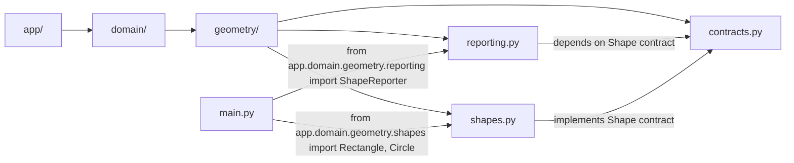
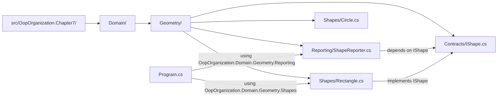

# Chapter 7 — Folder / Namespace / Import Mapping 

## Python (packages and imports)

Key mapping:
- Folder `app/domain/geometry` corresponds to import prefix `app.domain.geometry.*`

## C# (folders to namespaces)

Key mapping:
- Folder `Domain/Geometry/Shapes` maps to `namespace OopOrganization.Domain.Geometry.Shapes;`

## JavaScript (ES Modules + import surfaces)
```mermaid
flowchart LR
  A[src/] --> B[domain/]
  B --> C[geometry/]
  C --> D[contracts/Shape.js]
  C --> E[shapes/Rectangle.js]
  C --> F[shapes/Circle.js]
  C --> G[shapes/index.js]
  C --> H[reporting/ShapeReporter.js]
  I[main.js] -->|import {Rectangle,Circle} from shapes/index.js| G
  I -->|import {ShapeReporter} from reporting/ShapeReporter.js| H
  E -->|extends Shape| D
  F -->|extends Shape| D
```
Key mapping:
- Folder layout becomes import paths like `./domain/geometry/shapes/index.js`
