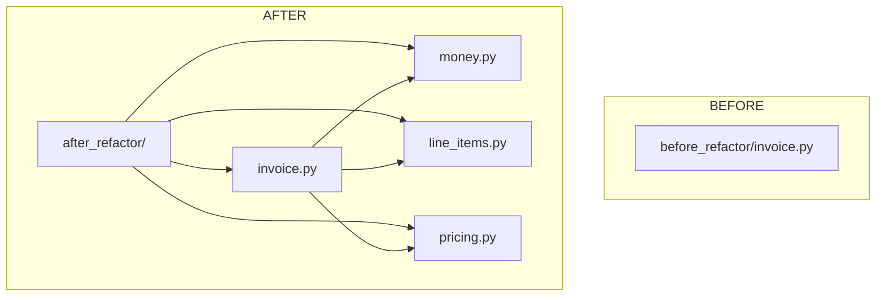
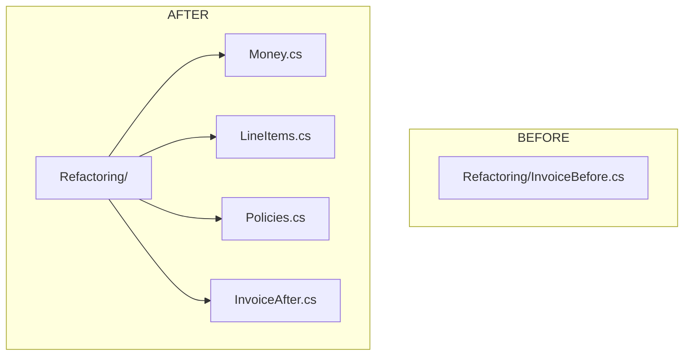
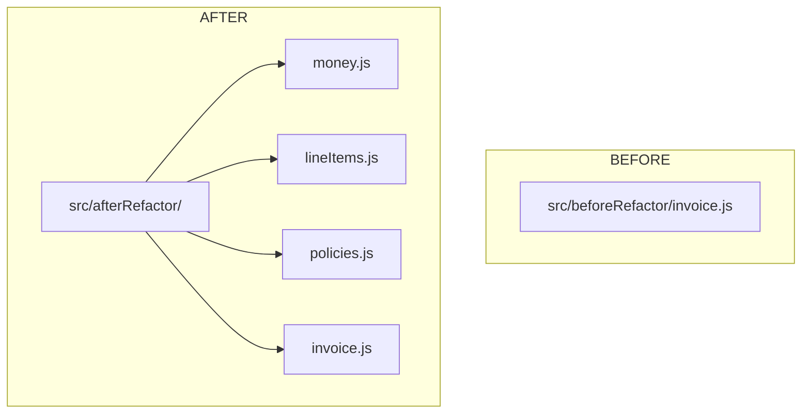

# Chapter 8 — Refactoring Structure (BEFORE + AFTER)

## Key refactoring move
- **BEFORE**: branching + magic-key dictionaries in one function.
- **AFTER**: contracts + polymorphism + policy objects.

## Python

Teaching angle:
- Replace `if/elif` with **polymorphic line items**.
- Move rule variations into **policies**.

## C#

Teaching angle:
- `ILineItem` enables open/closed extension.
- Policies are swappable for tests or different regions.

## JavaScript

